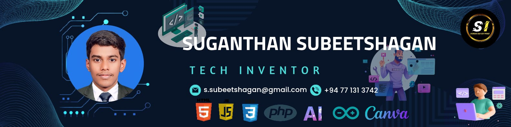

<!-- Banner Image -->

<h1 align="center">Hi there, I'm S.Subeetshagan!</h1>

  <b>Founder of Subee Industries</b> 
  Tech Enthusiast | Web Developer | Creator | Arduino Expert | Video Editor | Canva Graphics designing

---

### 🔧 Languages & Tools I Use

  
  
  
  
  
  
  

---

### 📌 About Me

- Currently studying at **T/T/Orr's Hill Vivekananda College** and University of Moratuwa - Open Learning Platform (Web Development)  
- Passionate about **Arduino Projects**, **Web Development**, and **AI Systems**  
- Active on **YouTube**: [Subee Industries](https://www.youtube.com/@SubeeIndustries)  
- Working on my own startup – **Subee Industries**

---

### 🔗 Let's Connect

  
  
  
  
  
  
  
  
  
  
  

---

### ✨ Featured Projects

- [LP Gas Leakage Alert System](#)
- [Solar Tracker with Arduino](#)
- [Wi-Fi Fire Truck with ESP32](#)
- [Personal AI Assistant — J.A.R.V.I.S](#)

---

> *"Build. Innovate. Inspire." – S.Subeetshagan (**©SUBEEOFFICIAL26**)*
